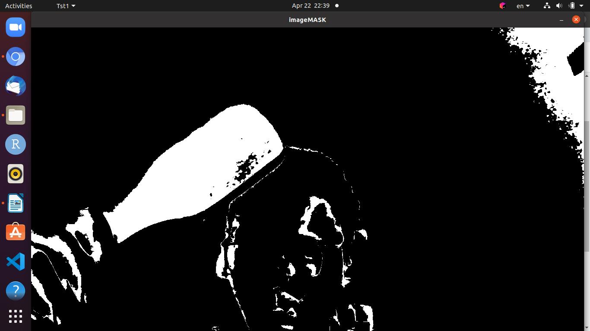
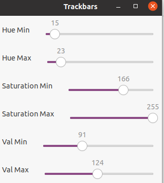
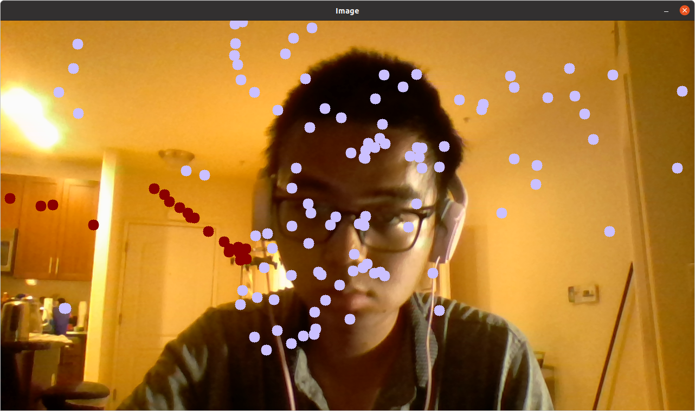

# VIRTUAL PAINTER #
It is an implementation of a virtual painter based on C++ and Opencv library.
# STEPS #
Step0:
Requirements:
Ubuntu 20.04
webcam
opencv4
g++

Step1:
You need to have several objects which have single and clear color. You will need to
use them as your painters in the next steps.

Step2:
Run the code: 
```
cd src
export DISPLAY=:0; g++ -o tst1 colorPicker.cpp `pkg-config opencv4 --cflags --libs`
./tst1
```
Use your webcam to determine your colors' parameters which is exactly your painter's color.
Adjust your scrollwindow's parameters.
See:

And the trackbar:


Step3:
Close all windows and end the program run during the Step2.

Step4:
Run:
```
export DISPLAY=:0; g++ -o tst1 Project1.cpp `pkg-config opencv4 --cflags --libs`
./tst1

```
See the image:

